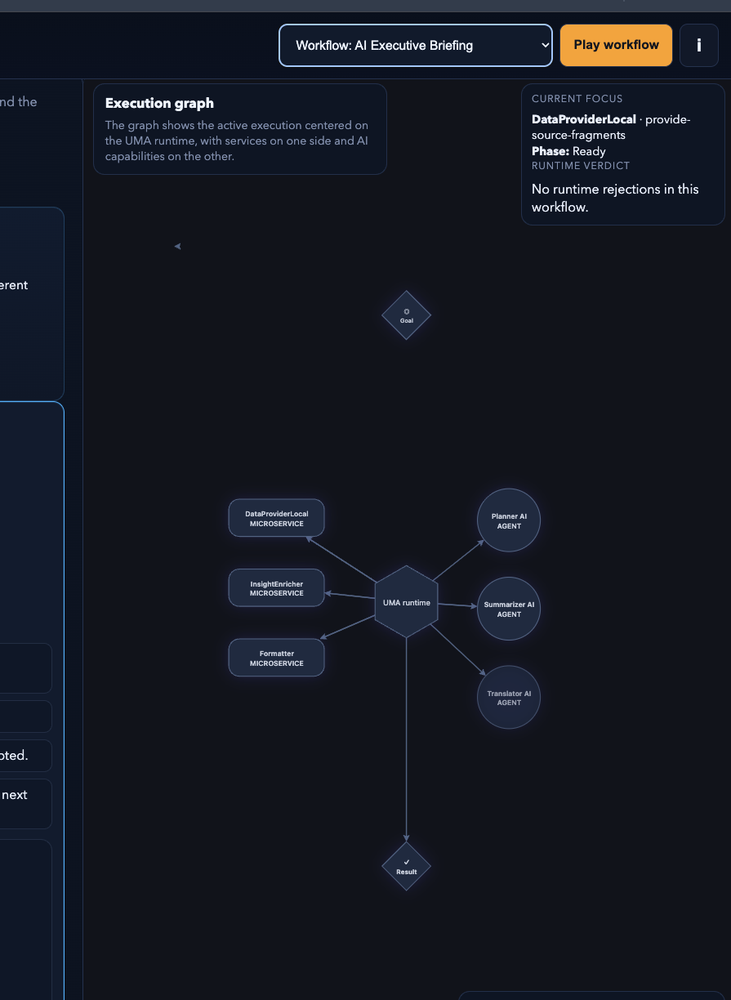
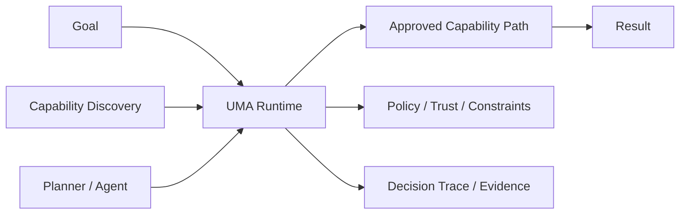

[](https://www.universalmicroservices.com/)


# Universal Microservices Architecture (UMA) Code Examples

[](https://github.com/enricopiovesan/UMA-code-examples/actions/workflows/reader-smoke.yml)
[](https://github.com/enricopiovesan/UMA-code-examples/actions/workflows/business-logic-coverage.yml)
[](https://github.com/enricopiovesan/UMA-code-examples/actions/workflows/business-logic-coverage.yml)
[](https://github.com/enricopiovesan/UMA-code-examples/actions/workflows/benchmark-proof.yml)
[](https://github.com/enricopiovesan/UMA-code-examples/actions/workflows/book-site-pages.yml)
[](https://www.universalmicroservices.com/reference-application/)
[](https://www.amazon.com/Universal-Microservices-Architecture-Device-Independent-Modelling/dp/B0GTTTTQH4)
[](https://medium.com/the-rise-of-device-independent-architecture)

This repository is the runnable companion for **Universal Microservices Architecture (UMA)** and a reference implementation of its core patterns.

UMA is an execution model for distributed systems where compute can happen in many places and the system decides where logic runs. The repo exists to prove that model with code, not just describe it.

[Buy the book and learn more about UMA](https://www.amazon.com/Universal-Microservices-Architecture-Device-Independent-Modelling/dp/B0GTTTTQH4)

[Try the live UMA Reference APP](https://www.universalmicroservices.com/reference-application/)
[Read the benchmark and footprint notes](https://www.universalmicroservices.com/benchmark-and-footprint/)


## Why This Repo Exists

Most teams do not struggle because they cannot deploy services. They struggle because the same business behavior keeps getting rewritten across runtimes:

- once in the browser for responsiveness
- again in the backend for authority
- again in the edge layer for latency
- again in workflow glue
- and now again in AI-assisted paths

UMA is a response to that fragmentation problem.

If you want the shortest site explanation of that gap, start here:

- [What problem does UMA solve?](https://www.universalmicroservices.com/what-problem-does-uma-solve/)

## What Makes UMA Different

UMA is not trying to replace deployment platforms, service meshes, or WebAssembly tooling.

It is trying to answer a different architectural question:

> How do you keep one behavior portable, governed, and explainable as execution moves across many runtimes?

The shortest honest UMA slogan is:

> Write once, run where it makes sense.

The repo demonstrates a few specific answers:

- a portable service boundary that stays recognizable across runtimes
- explicit contracts instead of hidden behavior in framework glue
- a runtime that discovers, validates, approves, and explains execution
- workflows built from capabilities rather than hardcoded stack-shaped assumptions
- agent participation without agent authority

## Why This Exists Instead Of Simpler Alternatives

| Approach | Useful for | What it usually leaves unresolved |
| --- | --- | --- |
| Shared library | Reusing logic inside one stack | Runtime governance, trust, and workflow visibility across surfaces |
| Standard microservice | Deployable backend ownership | Behavioral drift across browser, edge, workflow, and AI-assisted paths |
| Edge function | Low-latency local execution | Durable portability and runtime-visible approval across the full system |
| OpenAPI-described API | Interface clarity between services | Capability discovery, governed workflow composition, and execution trace |
| UMA | Portable behavior plus governed execution | Higher architectural discipline and stronger runtime modeling overhead |

If you want the comparison page first:

- [UMA vs traditional microservices](https://www.universalmicroservices.com/uma-vs-traditional-microservices/)

## When UMA Fits

UMA is a strong fit when:

- the same business behavior is drifting across browser, edge, backend, workflow, or AI-assisted paths
- you need runtime-visible approval, rejection, trust, or policy decisions
- you want portable logic without hiding the execution model
- you need a cleaner boundary between planning and runtime authority

## When UMA Does Not Fit

UMA is probably too much when:

- one backend service already solves the problem cleanly
- you do not need behavior portability across runtime surfaces
- runtime-visible governance would add more ceremony than value
- a simpler service or library boundary is enough for the system you actually have

## Non-goals

UMA is not trying to:

- force every service into WebAssembly
- replace every microservice pattern with a new label
- eliminate native platform features or runtime-specific optimization
- make every service run everywhere
- pretend infrastructure, trust, and host constraints no longer matter

## What You Can Try Today

If you want one fast proof point:

1. Open the [live reference app](https://www.universalmicroservices.com/reference-application/).
2. Play the workflow.
3. Watch the runtime approve the path and explain the result.

If you want the runnable repo path:

1. Start with Chapter 4.
2. Follow the examples chapter by chapter.
3. End with Chapter 13, where the full reference application ties the model together.

[](https://www.universalmicroservices.com/reference-application/)

## Architecture At A Glance



The examples ladder through that model deliberately:

- Chapter 4: smallest portable service boundary
- Chapter 5: runtime layer around the service
- Chapter 6: portability proof
- Chapter 7: orchestration from contracts and metadata
- Chapters 8-12: graph evolution, trust, coherence, and discoverable decisions
- Chapter 13: full reference application and runtime-centered execution model

## Start Here

### Fastest conceptual path

- [What is UMA?](https://www.universalmicroservices.com/what-is-uma/)
- [What problem does UMA solve?](https://www.universalmicroservices.com/what-problem-does-uma-solve/)
- [What is a capability?](https://www.universalmicroservices.com/what-is-a-capability/)
- [What is a workflow?](https://www.universalmicroservices.com/what-is-a-workflow/)
- [What is a UMA runtime?](https://www.universalmicroservices.com/what-is-a-uma-runtime/)
- [Agent vs runtime](https://www.universalmicroservices.com/agent-vs-runtime/)

### Fastest runnable path

```bash
./scripts/smoke_reader_paths.sh
```

If you want a real 10-minute evaluation path:

1. open the [live reference app](https://www.universalmicroservices.com/reference-application/)
2. run `./scripts/smoke_reader_paths.sh`
3. inspect [Chapter 4](chapter-04-feature-flag-evaluator/README.md) and [Chapter 13](chapter-13-portable-mcp-runtime/README.md)

That gives you:

- one minimal portable service
- one full governed workflow
- one fast way to judge whether UMA is useful for your context

### Best single demo

- [Chapter 13 README](chapter-13-portable-mcp-runtime/README.md)
- [Live UMA Reference APP](https://www.universalmicroservices.com/reference-application/)

## Reader Journey

| Chapter | Example | What it proves | First command |
| --- | --- | --- | --- |
| 4 | [**Feature Flag Evaluator**](chapter-04-feature-flag-evaluator/README.md) | The smallest portable UMA service with one contract and deterministic output. | `cd chapter-04-feature-flag-evaluator && ./scripts/run_lab.sh lab1-country-match` |
| 5 | [**Post Fetcher Runtime**](chapter-05-post-fetcher-runtime/README.md) | What belongs in the runtime layer around a pure service. | `cd chapter-05-post-fetcher-runtime && ./scripts/run_lab.sh lab1-cloud-golden-path` |
| 6 | [**UMA Portability Lab**](chapter-06-portability-lab/README.md) | How portability is proven instead of assumed. | `cd chapter-06-portability-lab && ./scripts/run_lab.sh lab1-native-wasm-parity` |
| 7 | [**Metadata Orchestration and Validation**](chapter-07-metadata-orchestration/README.md) | How orchestration can emerge from contracts, metadata, and events. | `cd chapter-07-metadata-orchestration && ./scripts/run_lab.sh lab1-baseline-cloud-flow` |
| 8 | [**Service Graph Evolution with Git**](chapter-08-service-graph/README.md) | How compatibility and change shape a visible service graph. | `cd chapter-08-service-graph && ./scripts/run_graph_demo.sh lab1-upload-only` |
| 9 | [**Trust Boundaries and Runtime Enforcement**](chapter-09-trust-boundaries/README.md) | How trust, provenance, and policy remain explicit around portable execution. | `cd chapter-09-trust-boundaries && ./scripts/run_trust_demo.sh lab1-trusted-service` |
| 10 | [**Architectural Tradeoffs and Runtime Coherence**](chapter-10-architectural-tradeoffs/README.md) | How a system can still function while becoming architecturally incoherent. | `cd chapter-10-architectural-tradeoffs && ./scripts/run_arch_demo.sh lab1-baseline` |
| 11 | [**Evolution Without Fragmentation**](chapter-11-evolution-without-fragmentation/README.md) | How drift, coexistence, and version sprawl can stay governed instead of becoming chaos. | `cd chapter-11-evolution-without-fragmentation && ./scripts/run_evolution_demo.sh lab1-contract-anchor` |
| 12 | [**Discoverable Decisions**](chapter-12-discoverable-decisions/README.md) | How proposal, validation, approval, and trace become queryable system artifacts. | `cd chapter-12-discoverable-decisions && ./scripts/run_decision_demo.sh lab1-capability-projection` |
| 13 | [**Portable MCP Runtime**](chapter-13-portable-mcp-runtime/README.md) | The full UMA reference application: capability discovery, runtime validation, agent proposals, event-driven execution, and structured output. | `cd chapter-13-portable-mcp-runtime && ./scripts/run_lab.sh use-case-2-ai-report` |

## What Has Been Proven Here

- deterministic business logic can stay portable across validated runtime paths
- runtime concerns can stay outside the portable core and remain explicit
- workflows can be built from capabilities instead of hardwired pipelines
- trust, compatibility, and execution approval can remain visible system concerns
- the Chapter 13 reference application can expose one workflow as graph, narrative, and execution evidence

## Benchmark And Footprint Proof

The repo now publishes a small benchmark-and-footprint proof surface for selected early chapters:

- [website summary page](https://www.universalmicroservices.com/benchmark-and-footprint/)
- [generated benchmark report](benchmarks/benchmark-proof.md)
- [benchmark generator script](scripts/report_benchmark_proof.py)

The goal is not to claim that UMA is always the fastest path. The goal is to show that portable behavior can stay measurable, compact, and comparable while runtime choice remains explicit.

## Current Roadmap

- keep the reference app and concept site aligned as the primary proof surface
- continue improving validated reader paths and contributor ergonomics
- publish clearer release milestones once the public baseline stabilizes

## Repo Structure

- `chapter-04-*` through `chapter-13-*`
  - validated labs and reference implementations aligned with the learning path
- `book-site/`
  - the public site and concept pages at [universalmicroservices.com](https://www.universalmicroservices.com/)
- `benchmarks/`
  - generated proof artifacts for the published benchmark and footprint notes
- `scripts/`
  - reader smoke, coverage, and repo-quality helpers

For the top-level helper scripts, see [scripts/README.md](scripts/README.md).

## Reader Setup

Common prerequisites for the validated reader path:

- Rust with `wasm32-wasip1`
- Node.js 20+
- `npm`
- `wasmtime` on your `PATH`
- optional: `jq`

Useful repo-level commands:

```bash
./scripts/smoke_reader_paths.sh
./scripts/report_rust_coverage.sh
./scripts/check_rust_coverage.sh
./scripts/simulate_fresh_reader_checkout.sh
```

## If You Want To Evaluate UMA Honestly

The best path is not to read one slogan and decide.

Use this order instead:

1. Read the problem framing on the site.
2. Try the live reference app.
3. Inspect one early chapter and one late chapter in the repo.
4. Then decide whether the full book is worth your time.

That is exactly why the site, the repo, and the book are kept connected. The site gives you the framing, the repo gives you the proof, and the book goes deeper into the model, the tradeoffs, and the design sequence behind it.

## Learn More

- Book: [https://www.amazon.com/Universal-Microservices-Architecture-Device-Independent-Modelling/dp/B0GTTTTQH4](https://www.amazon.com/Universal-Microservices-Architecture-Device-Independent-Modelling/dp/B0GTTTTQH4)
- Site: [https://www.universalmicroservices.com/](https://www.universalmicroservices.com/)
- Live reference app: [https://www.universalmicroservices.com/reference-application/](https://www.universalmicroservices.com/reference-application/)
- Medium blog: [https://medium.com/the-rise-of-device-independent-architecture](https://medium.com/the-rise-of-device-independent-architecture)
- Contribution guide: [CONTRIBUTING.md](CONTRIBUTING.md)

## License

This repository is available under either of these licenses, at your option:

- [MIT](LICENSE-MIT)
- [Apache-2.0](LICENSE-APACHE)
