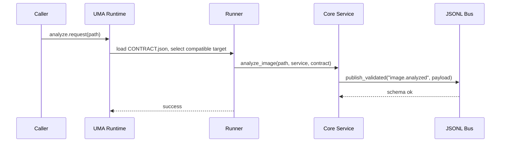

# UMA Runtime Sequence for Chapter 6.7

```mermaid
sequenceDiagram
    participant Caller
    participant UMA as UMA Runtime
    participant Runner as Runner
    participant Core as Core Service
    participant Bus as JSONL Bus

    Caller->>UMA: analyze.request(path)
    UMA->>Runner: load CONTRACT.json, select compatible target
    Runner->>Core: analyze_image(path, service, contract)
    Core->>Bus: publish_validated("image.analyzed", payload)
    Bus-->>Core: schema ok
    Runner-->>UMA: success
```

Diagram 3: Runtime reads the contract, selects the runner, executes shared logic, then validates and emits events.
